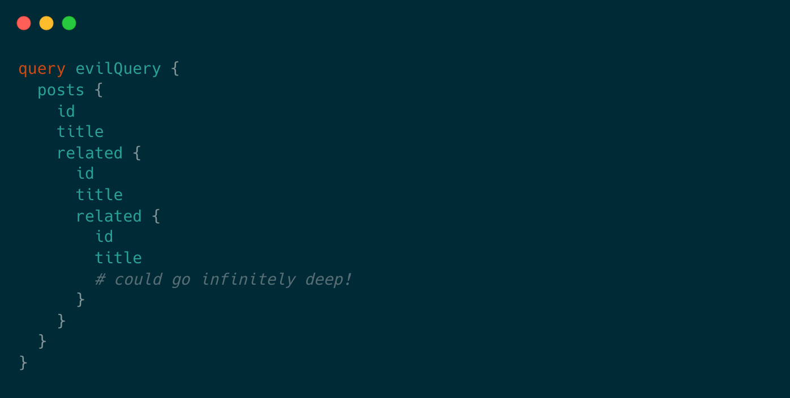
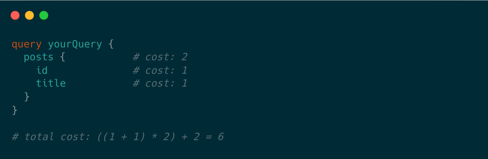
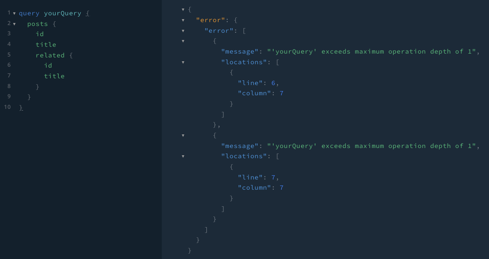
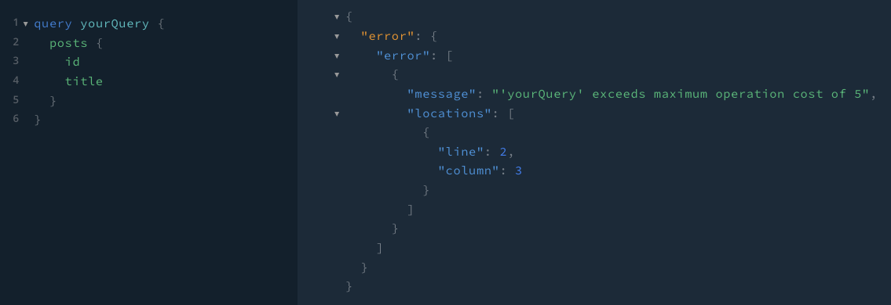

<div align="center">
  
  <h1>GuarDenoQL</h1>
  <p><em>Simple and customizable security middleware for GraphQL servers in Deno.</em></p>
</div>

# Features

- Integrates with an Opine server in a Deno runtime.
- Enables users to customize both a _**maximum depth**_ and a _**cost limit
  algorithm**_ for all GraphQL queries and mutations sent to the server.
- Validates queries and mutations against the depth limiter and/or cost limiter
  before they are executed by the server.

# Why?

### **Depth Limiting**

Because GraphQL schemas can be cyclic graphs, it is possible that a client could
construct a query such as this one:

<div>
  
</div>
Therefore, if nested deep enough, a malicious actor could potentially bring your server down with an abusive query.
<br />
<br />

However, using a **Depth Limiter**, you can validate the depth of incoming
queries against a user-defined limit and prevent these queries from going
through.

### **Cost Limiting**

Queries can still be very expensive even if they aren't nested deeply. Using a
**Cost Limiter**, your server will calculate the total cost of the query based
on its types before execution.

<div>
  
</div>

See this article for futher information:
https://shopify.engineering/rate-limiting-graphql-apis-calculating-query-complexity

# Getting Started

A set up with [gql](https://github.com/deno-libs/gql) and
[Opine](https://github.com/cmorten/opine) out-of-the-box:

```typescript
import { opine, OpineRequest } from "https://deno.land/x/opine@2.2.0/mod.ts";
import { GraphQLHTTP } from "https://deno.land/x/gql@1.1.2/mod.ts";
import { makeExecutableSchema } from "https://deno.land/x/graphql_tools@0.0.2/mod.ts";
import { gql } from "https://deno.land/x/graphql_tag@0.0.1/mod.ts";
import { readAll } from "https://deno.land/std@0.148.0/streams/conversion.ts";

import { guarDenoQL } from "../mod.ts";

type Request = OpineRequest & { json: () => Promise<any> };

const typeDefs = gql`
  type Query {
    hello: String
  }
`;

const resolvers = { Query: { hello: () => `Hello World!` } };
const dec = new TextDecoder();
const schema = makeExecutableSchema({ resolvers, typeDefs });
const app = opine();

app
  .use("/graphql", async (req, res) => {
    const request = req as Request;

    request.json = async () => {
      const rawBody = await readAll(req.raw);
      const body = JSON.parse(dec.decode(rawBody));
      const query = body.query;

      const error = guarDenoQL(schema, query, {
        depthLimitOptions: {
          maxDepth: 4, // maximum depth allowed before a request is rejected
          callback: (args) => console.log("query depth is:", args), // optional
        },
        costLimitOptions: {
          maxCost: 5000, // maximum cost allowed before a request is rejected
          mutationCost: 5, // cost of a mutation
          objectCost: 2, // cost of retrieving an object
          scalarCost: 1, // cost of retrieving a scalar
          depthCostFactor: 1.5, // multiplicative cost of each depth level
          callback: (args) => console.log("query cost is:", args), // optional
        },
      });

      if (error !== undefined && !error.length) {
        return body;
      } else {
        const errorMessage = { error };
        return res.send(JSON.stringify(errorMessage));
      }
    };

    const resp = await GraphQLHTTP<Request>({
      schema,
      context: (request) => ({ request }),
      graphiql: true,
    })(request);

    for (const [k, v] of resp.headers.entries()) res.headers?.append(k, v);
    res.status = resp.status;
    res.send(await resp.text());
  })
  .listen(3000, () => console.log(`☁  Started on http://localhost:3000`));
```

GuarDenoQL is fully configurable per feature.

Users can use either the depth limiter, cost limiter or both.

The first argument is the `schema`, the second argument is the `query` and the
third argument is an `Object` with up to two properties: `depthLimitOptions`
and/or `costLimitOptions`.

### **Depth Limit Configuration**

This feature limits the depth of a document.

```typescript
const error = guarDenoQL(schema, query, {
  depthLimitOptions: {
    maxDepth: 4, // maximum depth allowed before a request is rejected
    callback: (args) => console.log("query depth is:", args), // optional
  },
});
```

The `depthLimitOptions` object has two properties to configure:

1. `maxDepth`: the depth limiter will throw a validation error if the document
   has a greater depth than the user-supplied `maxDepth`

2. optional `callback` function: receives an `Object` that maps the name of the
   operation to its corresponding query depth

### **Cost Limit Configuration**

This feature applies a cost analysis algorithm to block queries that are too
expensive.

```typescript
const error = guarDenoQL(schema, query, {
  costLimitOptions: {
    maxCost: 5000, // maximum cost allowed before a request is rejected
    mutationCost: 5, // cost of a mutation
    objectCost: 2, // cost of retrieving an object
    scalarCost: 1, // cost of retrieving a scalar
    depthCostFactor: 1.5, // multiplicative cost of each depth level
    callback: (args) => console.log("query cost is:", args), // optional
  },
});
```

The `costLimitOptions` object has six properties to configure:

1. `maxCost`: the cost limiter will throw a validation error if the document has
   a greater cost than the user-supplied `maxCost`

2. `mutationCost`: represents the cost of a mutation (some popular
   [cost analysis algorithms](https://shopify.engineering/rate-limiting-graphql-apis-calculating-query-complexity)
   will make mutations more expensive than queries)

3. `objectCost`: represents the cost of an object that has subfields

4. `scalarCost`: represents the cost of a scalar

5. `depthCostFactor`: the multiplicative cost of each depth level

6. optional `callback` function: receives an `Object` that maps the name of the
   operation to its corresponding query cost

# Functionality

### **Depth Limiter**

<div>
  
</div>

### **Cost Limiter**

<div>
  
</div>

# How to Contribute

If you would like to contribute, please see
<a src="https://github.com/oslabs-beta/GuarDenoQL/blob/readme/CONTRIBUTING.md">CONTRIBUTING.md</a>
for more information.

# Authors

Finley Decker: <a src="https://github.com/finleydecker">GitHub</a> |
<a src="https://www.linkedin.com/in/finleydecker/">LinkedIn</a>

Hannah McDowell: <a src="https://github.com/hannahmcdowell">GitHub</a> |
<a src="https://www.linkedin.com/in/hannah-lisbeth-mcdowell/">LinkedIn</a>

Jane You: <a src="https://github.com/janeyou94">GitHub</a> |
<a src="https://www.linkedin.com/in/janeyou-pharmd-bcacp/">LinkedIn</a>

Lucien Hsu: <a src="https://github.com/LBLuc">GitHub</a> |
<a src="https://www.linkedin.com/in/lucien-hsu/">LinkedIn</a>

# License

Distributed under the MIT License. See
<a src="https://github.com/oslabs-beta/GuarDenoQL/blob/dev/LICENSE">LICENSE</a>
for more information.
